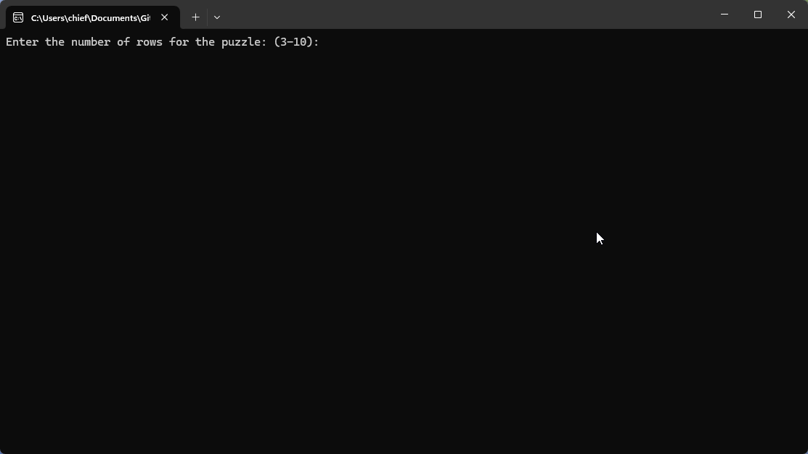

# Sliding Puzzle

A simple adjustable sliding puzzle mini-game that runs on Windows Console made in C++

## Features
    Dynamic memory allocation,
    Adjustable puzzle size,
    Error handling,
    UI design, 
    Windows API calls,
    Random behaviors, 
    Simple refreshing and keystroke processing.

## How to Run
Using an IDE (e.g., Visual Studio, CLion, Code::Blocks)

    Just simply open the Super Sliding Puzzle.sln and run with debugging in your IDE of choice 

## Demo Output

